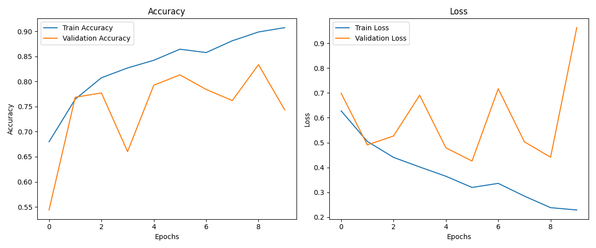
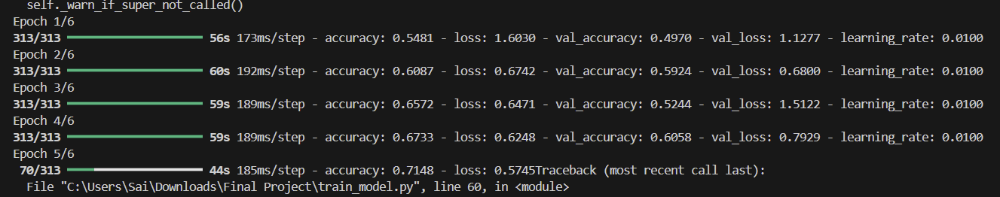
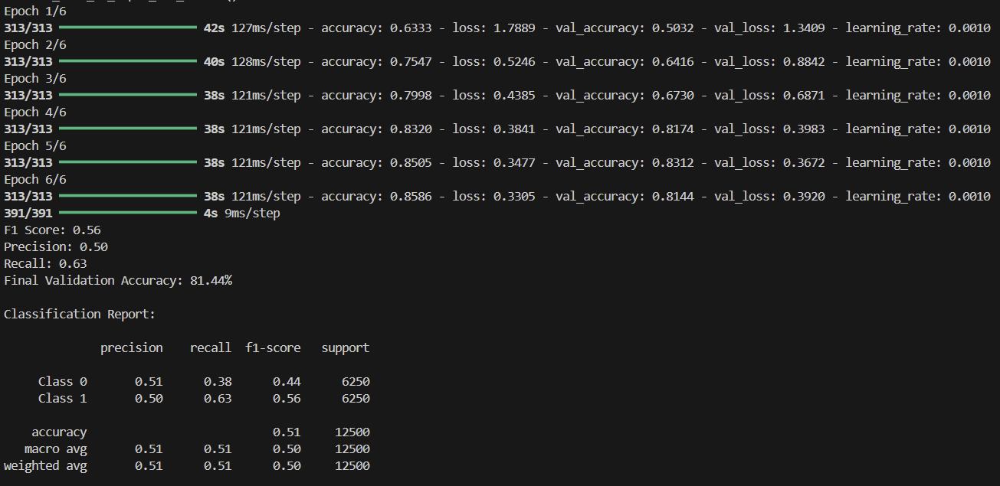
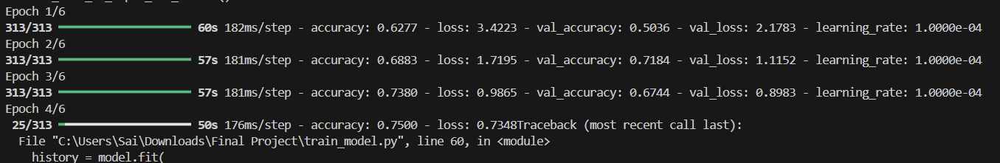
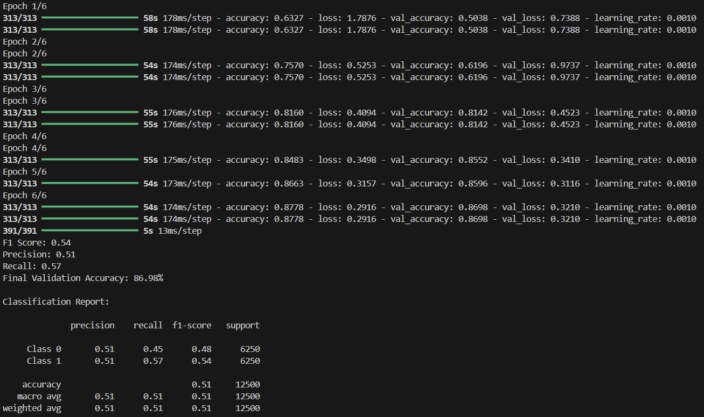

# Report

## Approach

In order to avoid decision fatigue, I chose to do the binary classification problem, which was to distinguish between cats and dogs. As mentioned, this is a fairly intuitive task for the human brain and we do it without thinking about it much. However, training a computer and more specifically a model seems to be a more challenging task. Ofcourse, there are large pre-trained models that achieve a respectable 90%> validation accuracy, but training a model on our own was proven to be a more challenging task. 

The primary focus while working on this project was on how the model is constructed. I wanted to make sure that I implement a lot of the techniques that I learned throughout this semester, and have an overall comprehensive understanding of the project. I was aware that a conceptually abstract goal for this project was not enough to push me to understand the model further, so I set a goal of achieving an overall final validation accuracy of over 80% (preferably over 85%).

## Data processing

One of my challenges in any project that I work on seems to start with handling the data, and this project was no different. The most obvious problem that I had was with the file structure management and error handling when it came to the path names. To avoid this, I started organizing the files neatly into my working directory so that I can skip long path names to begin with. After all of the file structures were organized, I was confident I would be able to traverse the data and use it for the model. However, there seemed to be gaps in the file structure (as this was manually done) so there was resulting data corruption. To diagnose this, I created a python script file (named “debug.py”). With the help of this and some more research, I was finally able to move on from what seemed trivial. 

After the model was up and running, the immediate observation was that each of the iterations was taking too long for the model to train on. To avoid this, I made sure that I pre-processed the images before training the model. The essential point was to reduce the dimensionality so that we make the images and the data much lighter to process as well as preserving the integrity of the images. For binary classification problems like this classical cat vs dogs, the color channel does not contribute to enough information gain, so I made sure that I reduced the color dimension as well as resizing the images to match a standard. Additionally, downscaling was implemented to make sure that the images were consistent as well. As the final step of ensuring consistency was the step involving normalization, a process that is practiced throughout the semester. 

Tuning a model requires the intricate adjustments of parameters such as the learning rate and hence takes a lot of reruns of the application. While rerunning, a significant amount of time was also spent by reprocessing the dataset redundantly. Since tuning the model does not necessarily involve the dataset, I made sure to add logic to skip pre-processing if it's already done. With this, I had covered the fundamentals of what made the data processing of this project successful.

## Model contruction

To carry on with the holistic approach that I set out to achieve, I made sure that the model is not just a regular convolutional neural network with three blocks and a dense layer, but a hybrid of two of the models that I was made aware of throughout the semester. 

To do this, I defined a hybrid model combining a convolutional neural network and transformer to leverage the strength of both architectures. The CNN extracts the spatial features from the image, while the transformer has the job of capturing the global relationships among those features. 

I started off by defining an input layer with the appropriate dimensions (considering that there is one channel from the previous grayscale data processing). For the first convolutional block, I applied a 2D layer with 32 filters and used the much discussed ‘ReLu’ activation functions. One of the errors that I had was regarding the mismatch of the spatial dimensions between the output and the input and with some research, I was able to add the parameter “padding=’same’” to mitigate this. I also added batch normalization as this reduces the sensitivity to initialization. After, I downsampled the feature map by a factor of 2, reducing its spatial dimensions and focusing on the most important features. With each consecutive block moving forward, I increased the filter count exponentially. Finally, I added a global average pooling aspect that reduces the computational complexity and makes the data compatible with subsequent layers. 

When it came to the transformer, I added 4 heads to capture the relationships between the features, even if they are distant in the input. After the construction of the dense layers and output layer, I was ready to train and run the model. 

## Model training

The final step of this project was to train the model and have it be measured against important metrics to ensure proper functioning and performance of the model. The first and the most obvious metrics that were important to run came in the form of validation/training accuracy and validation/training loss curves. With the first run, I got sporadic and generally disappointing results (as expected). We can see them in the figure below:

The train accuracy was as expected, but the more important metric (validation loss) is sporadic and generally not acceptable. 

To avoid this, there were several hours and a lot of energy invested in tuning the model and the parameters just right so that I can avoid the discrepancy. After some inspection, I found that this discrepancy can be attributed to overfitting (as the model performs well on the training data and not the validation) so I took measures to mitigate this issue. First of these was to add a significant dropout (40 percent) to the model architecture to randomly deactivate neurons and prevent overfitting. Additionally, I also added a data augmentation for the training data so that the model is more robust in its predictions. 

A lot of fine tuning was then done to further improve the performance. However, finding the correct number of epochs (to avoid a plateau) and the appropriate learning rate was the most significant. For instance, I started off with a relatively high learning rate, which triggered the early stopping metric as the improvement between epochs for the validation accuracy was minimal. The image below demonstrates this. 

Decreasing this by a factor of 10 made a huge improvement as I was able to hit the performance goal that I was initially hoping for (above 80%), with this specific model architecture. We can see the improvement visually in the image below. 

Just to make sure that I am not missing out on any potential improvements, I decreased the learning rate again by a factor of 10. With this change, I noticed a very slow improvement and sporadic results so this was not ideal for the large number of images that this model has to train on. increasing the epoch count to tackle this would only require more computation and time, which was not an ideal solution. For the result, we can take a look at the image below. 

To give the model one final push (and hopefully get it over the 85% mark), I wanted to try something different. For this approach, I thought that I would give the model more data to work with in the form of upscaling the images slightly. This was done based on one of the earliest observations. This was that the images that are being pre-processed are a little too blurry contributing to more noise. I did not actually believe that this step would make a noticeable difference but it did. The most apparent difference was that the model took longer to train (adding approximately 50ms for each step) but this was a compromise I welcomed as soon as I saw that the final model accuracy was over 85% (finally!) The final metrics can be seen in the figures that follow. 

.png)
